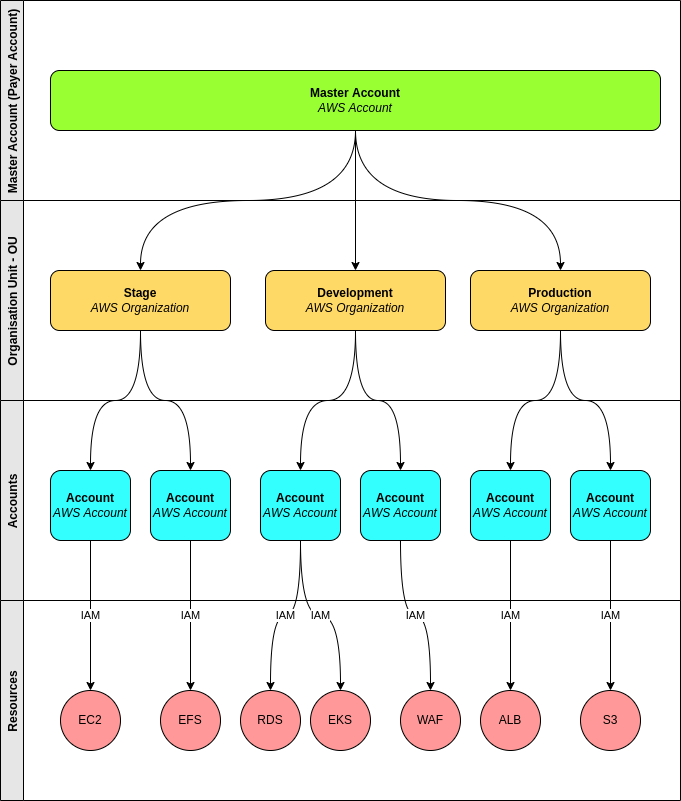

*__Blog Post Publish Date:__ 2022/05/10*

---

# AWS Account Foundation

In this article, we will delve into the pillars that underpin AWS account structure, understanding the significance of Accounts Foundation, the pivotal role of AWS Accounts, effective organization through AWS Organization, the implementation of security policies with SCP - Security Control Policy, and finally, the relevance of Support Center Plans. We will address each of these topics in detail, providing valuable insights to optimize your AWS cloud infrastructure.

## Foundations

Key points about Accounts Foundation:

- Critical for initializing a Cloud Project
- Optimal AWS Account usage doesn't rely on a single account
- There is no one-size-fits-all approach; strategy trumps rigidity
- AWS Accounts can be cost-effective

Implementing a hierarchical account strategy enhances Organization and Security. This approach involves organizing domain sections through sub-accounts, centralizing billing, and restricting resource creation permissions based on sub-accounts.

---

- __Master Account__: This comprises a single AWS Account, with only the Root Account in use. It's the initial account created and is responsible for creating or associating other sub-accounts. The primary function is to unify sub-account billing; no new Resources should be created here.

> The Root Account holder is the owner of the AWS Account.

- __Oraganisation Unit - OU__: An organizational structure to visually organize AWS Accounts and service security rules, typically created for domain departments.
> Identifying domain departments involves understanding characteristics of the resources present. If the types, lifecycles, and permissions differ, it likely represents a department.

- __Accounts__: These are the entities where resources and deployments are created. Each account has its identity associated with the resources created within it. Users should be created within this account.

- __Resources__: These encompass AWS services and items like EC2, S3, EKS, EFS, etc.

It's important not to confuse the Master Account with the Root Account. The Master Account is the initial AWS account created, while the Root Account is the user who owns an AWS Account.

AWS Organization is crucial for utilizing the Consolidated Billing feature, which centralizes billing for the sub-accounts.

There are two methods to create sub-accounts. In AWS Organization, you can create a new AWS account or invite an existing AWS account. Both methods involve using email. To accept an invite from an existing AWS account, navigate to the AWS Organization menu in the existing account's console and click on the "accept invite" option. The acceptance is not completed via email.

To restrict resource creation, SCP - Security Control Policies provide options to limit it to OUs or Accounts.

## Account Security Practices:

- Enable active MFA for all accounts, particularly the Root Account.
- For creating new accounts, a unique email is necessary. It's best practice to create an email group for the team and avoid using personal emails.
- Add alternate contacts to the Root Account to ensure receiving security contacts from AWS Support.

## Accounts Support Center Plans:

AWS offers various Support Plans levels:

- __Basic (free)__: Recommended for experimentation or testing in AWS.
- __Developer__: Minimum recommended tier for production workloads in AWS.
- __Business__: Recommended for production and/or business-critical workloads in AWS.
- __Enterprise__: Recommended for business and/or mission-critical workloads in AWS.

## References

- AWS Account: <https://aws.amazon.com/account/>
- AWS Organizations: <https://aws.amazon.com/organizations/>
- AWS Support Center Plans: <https://aws.amazon.com/pt/premiumsupport/plans/>
- AWS Landing Zone: <https://aws.amazon.com/solutions/aws-landing-zone/>
- AWS Billing: <https://docs.aws.amazon.com/awsaccountbilling/latest/aboutv2/useconsolidatedbilling-procedure.html>
- AWS SCP - Service Control Policies: <https://docs.aws.amazon.com/organizations/latest/userguide/orgs_manage_policies_scp.html>

---
