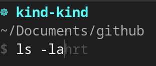

*__Blog Post Publish Date:__ 2024/02/08*

---

# ZSH + Starship: A Productivity Masterpiece

This blog post covers my experience in the prompts usage, my evolution until [ZSH](https://www.zsh.org/) + [Starship](https://starship.rs/), and my setup configuration.

## About my Prompts Experiences

Productivity is a topic that I definitely like. I always look better ways to execute the bored daily tasks, mainly in the terminal. For long time in my tech life, I used the raw terminal over Bash, It is force me to memorize the commands, but the productivity is not so good. I felt the necessity in the new shell adoption, focused in productivity.

I adopted the [xonsh](https://xon.sh/) as my primary shell. It was a great and funny experience. The [xonsh](https://xon.sh/) extend the shell commands base set with Python. I felt like a real _hackerman_ (_even if alternatives simple commands in the Bash performed exactly the same behavior_). The only limit my restriction, until the day that I wasn't understand that I'm doing. The union Bash + Python is funny, but is a chaos to debug (_to improve my position: Imagine the list comprehension with dicts and pipe grep... no more words is necessary._). 

I needed come back the real world again, then I gave a chance for zsh, which brings the productivity with several plugins, and the syntax almost the same the Bash. I really liked It, mainly when I tested the [Spaceship](https://github.com/spaceship-prompt/spaceship-prompt) (_"minimalistic, powerful and extremely customizable Zsh prompt"_), and the plugin manager [oh-my-zsh](https://ohmyz.sh/), which makes simple installation and tests new plugins and utility commands. Finally, I had reached a stable terminal setup, a good balance between productivity and simplicity. 

Over the course of the months, the startup delay got on my nerves (_to be honest, in MacOs only, in my Fedora workstation everything to be right_). I had read some articles and Youtube videos about how to improve the performance, but the result don't satisfied myself. Then, I tested the [Starship](https://starship.rs/), in my words, is the "_[Spaceship](https://github.com/spaceship-prompt/spaceship-prompt) alternative in Rust, blazing-fast, rocket emoji, with many stars in the GitHub_". I tested, and the results blew my mind. I had no efforts to rewrite my plugins customizations from the [Spaceship](https://github.com/spaceship-prompt/spaceship-prompt) to [Starship](https://starship.rs/), and the performance is excellent, and all my problems were solved.

## How to Setup: My ZSH + Starship 

I will explain how I configured my ZSH + Starship.

- `1`: Install the [ZSH](https://www.zsh.org/):

```{code-block} bash
$ dnf install zsh
```

- `2`: Install the [Starship](https://starship.rs/):

```{code-block} bash
$ curl -sS https://starship.rs/install.sh | sh
```

- `3`: Create a directory in your home to save the [ZSH](https://www.zsh.org/) plugins and the Starship configuration:

```{code-block} bash
$ mkdir $HOME/.config
$ mkdir $HOME/.my-custom-zsh/
```

- `4`: Download my custom starship configuration:

```{code-block} bash
$ curl -XGET https://raw.githubusercontent.com/c-neto/ansible-configure-fedora/main/files/dotfiles/starship.toml $HOME/.config/starship.toml
```

- `5`: Install `$ k` alias for `$ kubectl`:

```{code-block} bash
$ curl -XGET https://raw.githubusercontent.com/ohmyzsh/ohmyzsh/master/plugins/kubectl/kubectl.plugin.zsh > $HOME/.my-custom-zsh/kubectl.plugin.zsh
```

- `6`: Install the ZSH plugin [zsh-autosuggestions](https://github.com/zsh-users/zsh-autosuggestions).

```{code-block} bash
$ git clone --depth 1 https://github.com/zsh-users/zsh-autosuggestions ~/.my-custom-zsh/zsh-autosuggestions
```

- `7`: Restart your terminal, the results will be like this:



## Conclusion (Author Opinion)

Productivity is a dynamic goal. Utilize tools that meet your current needs, and continually enhance processes based on demands. Currently, for my DevOps routine, the combination of ZSH and Starship proves to be a balanced approach, offering a blend of performance, simplicity, productivity, and extendability.

## Links

- <https://starship.rs/>
- <https://github.com/c-neto/ansible-configure-fedora/tree/main/files/dotfiles>
