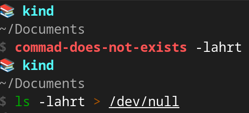

*__Blog Post Publish Date:__ 2024/02/08*

---

# ZSH + Starship: A Productivity Masterpiece

This blog post covers my prompt customization experience, favorite [ZSH](https://www.zsh.org/) Plugins, [ZSH options](https://zsh.sourceforge.io/Doc/Release/Options.html), and [Starship](https://starship.rs/) configuration. Finally, I introduce a simple guide to configure my custom theme from scratch.

## My Prompts Customization Experiences

Productivity is a topic that I definitely like. For long time, I used the raw Terminal over Bash, It is force me to memorize the commands, but the productivity is not so good. I felt that I need to improve my Terminal setup to focus in productivity.

Due to my expertise in Python, I have been testing [xonsh](https://xon.sh/) for approximately six months. The xonsh is a superset of Python that includes additional shell primitives familiar to Bash users. The combination of Bash and Python enhances productivity by blending the simplicity of Python syntax with the versatility of Bash. However, debugging can be challenging (_imagine a list comprehension in Python syntax combined with dictionaries and environment variables in Bash syntax_).

I needed come back the real world again, then I gave a chance for ZSH, a advanced and highly customizable command-line interface with enhanced productivity features and a large Plugins. It greatly appealed to me, mainly when I tested the [Spaceship](https://github.com/spaceship-prompt/spaceship-prompt) a _"minimalistic, powerful and extremely customizable ZSH prompt"_, and the [oh-my-zsh](https://ohmyz.sh/) framework that provides a simple way to manage Plugins and Themes. I believed I had reached a stable terminal configuration with a good balance between productivity and simplicity, but in the MacOs workstation, the input and startup delay of the commands got on my nerves.

I searched improvements tips in the Blog Posts and Youtube videos, but the result don't satisfied myself. Then, I opted to install the Plugins manually avoiding the _oh-my-zsh_, and I tested the [Starship](https://starship.rs/) (in my words: "_a Spaceship alternative, in Rust, blazing-fast, with many stars in the GitHub_").

The results were astonishing. I didn't have to put in any effort to transition my theme configuration from Spaceship to Starship, and the performance is exactly as I expected.

In the past few days, I tried out [Fish](https://fishshell.com/), described as "_a smart and user-friendly command line shell_". I was impressed by its performance and the built-in features in the default setup. _Starship_ also supports _Fish_, earning some positive points from me. I noticed better performance compared to ZSH, and the default configuration already includes features like dynamic syntax checking with color indicators, dynamic autocompletion based on the history file, and menu selection for command options and arguments. It's simple and __Ready to Use__.

However, there's a drawback: Fish is not compliant with the [POSIX sh definition](http://pubs.opengroup.org/onlinepubs/009695399/utilities/xcu_chap02.html). For instance, declaring variables using `$ FOOBAR=123` won't work, instead, you should use the correct syntax like `$ set FOOBAR 123`. This lack of compliance with POSIX is a downside for me, as it rules out the possibility of using _Fish_ in my daily work. Nevertheless, if ZSH is not an option, I'd still be willing to use Fish without any issues.

## My ZSH Favorite Plugins

There are numerous plugins available for ZSH. Typically, these plugins are managed by _oh-my-zsh_, which I use to simplify the exploration of plugins. However, I've noticed that these plugins are essentially single script files with a predefined set of functions and routines. Once I identify plugins that are relevant to my needs, I install them individually to eliminate any potential delays caused by _oh-my-zsh_.

I will present in the following sub-topics, my indispensable ZSH Plugins.

> _I only used the plugin that really make the difference in my work. Thus, don't feel strange about the low number._

### » `zsh-autosuggestions`: Dynamic Assistant to Remember Commands

No doubt, it is my favorite plugin. This plugin emulates the behavior of the _Fish_ shell, suggesting command completions dynamically based on history.


> <i class="fa-solid fa-link"></i> More Details: <https://github.com/zsh-users/zsh-autosuggestions>

---

### » `zsh-syntax-highlighting`: Valid Commands by Color

Another Plugin which emulate the _Fish_ shell. When a command is correctly typed, the color turns green. Otherwise, it changes to red. This feature is handy for detecting typos in a dynamic way



> <i class="fa-solid fa-link"></i> More Details: <https://github.com/zsh-users/zsh-syntax-highlighting/blob/master/>

---

### » `kubectl`: k alias for kubectl

This plugin adds completion for the Kubernetes, as well as some aliases for common kubectl commands.

For example:

```{code-block} bash
# shortcut for: kubectl get pods
$ kgp

# shortcut for: kubectl delete cm foobar-config-map
$ kdelcm foobar-config-map

# shortcut for: kubectl get cronjob
$ k get cj
```

> <i class="fa-solid fa-link"></i> More Details: <i class="fab fa-github"></i> [ohmyzsh/ohmyzsh/plugins/kubectl](https://github.com/ohmyzsh/ohmyzsh/tree/master/plugins/kubectl)

---

## My Starship Configuration

The simplicity is elegance. I customized my Starship prompt with only attributes of the tools important for me.

- [aws](https://starship.rs/config/#aws): Only the profile name of the my AWS session;
- [git](https://starship.rs/config/#git-branch): Only the Branch, no more info;
- [python](https://starship.rs/config/#python): The current activated virtualenv;
- [kubernetes](https://starship.rs/config/#kubernetes): The Kubernetes context name. Based on the name, I applied the different styles to explicit the study, tests, and production workloads.

## My favorite ZSH options (_setopt_)

Some behaviors in the ZSH can be enabled based on list of the [ZSH Options](https://zsh.sourceforge.io/Doc/Release/Options.html). Check the options that I enabled:

- `INTERACTIVE_COMMENTS`: Enable comments "#" expressions in the prompt shell;
- `APPEND_HISTORY`: Append new history entries to the history file;
- `INC_APPEND_HISTORY`: Save each command to the history file as soon as it is executed;
- `HIST_IGNORE_DUPS`: Ignore recording duplicate consecutive commands in the history (improve the performance of the _zsh-autosuggestions_);
- `HIST_IGNORE_SPACE`: Ignore commands that start with a space in the history;
- `SHARE_HISTORY`: Share the command history among multiple ZSH sessions.

> <i class="fa-solid fa-link"></i> More Details: <https://zsh.sourceforge.io/Doc/Release/Options.html>

## How to Setup My ZSH + Starship From Scratch

You can check my dotfiles contents in my GitHub in the Following Links:

- `~/.zshrc`: <i class="fab fa-github"></i> [c-neto/ansible-configure-fedora/files/dotfiles/.zshrc](https://github.com/c-neto/ansible-configure-fedora/tree/main/files/dotfiles/.zshrc)
- `~/.config/starship.toml`: <i class="fab fa-github"></i> [c-neto/ansible-configure-fedora/files/dotfiles/starship.toml](https://github.com/c-neto/ansible-configure-fedora/tree/main/files/dotfiles/starship.toml)

---

- `1` _optional_: Save a backup of your current dotfiles (`~/.zshrc` and `~/.zsh_history`):

```{code-block} bash
$ cp "$HOME/.zshrc" "$HOME/.zshrc.backup"
$ cp "$HOME/.zsh_history" "$HOME/.zsh_history.backup"
```

- `2`: Install the [ZSH](https://www.zsh.org/) with your package manager.

```{code-block} bash
# if fedora
$ dnf install zsh

# if macos
$ brew install zsh
```

- `3`: Install the [Starship](https://starship.rs/):

```{code-block} bash
$ curl -sS https://starship.rs/install.sh | sh
```

> <i class="fa-solid fa-circle-info"></i> __Nerd Font Intentionally Avoiding__: My `~/.config/starship.toml` (it will be downloaded in step __5__) does not need of [Nerd Font](https://www.nerdfonts.com/).

- `4`: Create a directory in your home to save the ZSH plugins and the Starship configuration:

```{code-block} bash
$ mkdir "$HOME/.config/"
$ mkdir "$HOME/.my-custom-zsh/"
```

- `5`: Download my custom [~/.config/starship.toml](https://github.com/c-neto/ansible-configure-fedora/tree/main/files/dotfiles/starship.toml):

```{code-block} bash
$ curl 'https://raw.githubusercontent.com/c-neto/ansible-configure-fedora/main/files/dotfiles/starship.toml' > "$HOME/.config/starship.toml"
```

- `6`: Install the plugins manually:

```{code-block} bash
# k alias
$ curl 'https://raw.githubusercontent.com/ohmyzsh/ohmyzsh/master/plugins/kubectl/kubectl.plugin.zsh' > "$HOME/.my-custom-zsh/kubectl.plugin.zsh"

# zsh-syntax-highlighting
$ git clone --depth 1 'https://github.com/zsh-users/zsh-syntax-highlighting.git' "$HOME/.my-custom-zsh/zsh-syntax-highlighting"

# zsh-autosuggestions
$ git clone --depth 1 'https://github.com/zsh-users/zsh-autosuggestions' "$HOME/.my-custom-zsh/zsh-autosuggestions"
```

- `7`: Download my custom [~/.zshrc](https://github.com/c-neto/ansible-configure-fedora/tree/main/files/dotfiles/.zshrc):

```{code-block} bash
$ curl 'https://raw.githubusercontent.com/c-neto/ansible-configure-fedora/main/files/dotfiles/.zshrc' > "$HOME/.zshrc"
```

> <i class="fa-solid fa-circle-info"></i> __Key Binding Tip__: You can customize the `bindkey` values according to your preferences. To find the code for your keys, run `$ cat -v` and press the desired key; the code will be displayed in your shell. This way, you can modify the functions like `forward-word`, `backward-word` based on your key preferences.
>
> More details about _bindkey_ options (_Standard Widgets_): <https://zsh.sourceforge.io/Doc/Release/Zsh-Line-Editor.html#Zle-Widgets>

- `8`: Restart your terminal, the results will be like this:


## Conclusion (Author Opinion)

Productivity is a dynamic goal, and tools must fit your current needs and continually may be changed to enhance processes based on demands.

Currently, for my DevOps routine, the combination of ZSH and Starship proves to be a balanced cross-platform approach, offering a blend of performance, productivity, and extendability.

Ultimately, I reserve an honorable mention for _Fish_ which your default configuration is a source of inspiration for the plugins I use in ZSH.

## Links

- My dotfiles:
    - `~/.zshrc`: <i class="fab fa-github"></i> [c-neto/ansible-configure-fedora/files/dotfiles/.zshrc](https://github.com/c-neto/ansible-configure-fedora/tree/main/files/dotfiles/.zshrc)
    - `~/.config/starship.toml`: <i class="fab fa-github"></i> [c-neto/ansible-configure-fedora/files/dotfiles/starship.toml](https://github.com/c-neto/ansible-configure-fedora/tree/main/files/dotfiles/starship.toml)
- ZSH Reference:
    - <https://www.zsh.org/>
    - <https://zsh.sourceforge.io/Doc/Release/Options.html>
    - <https://zsh.sourceforge.io/Doc/Release/Zsh-Line-Editor.html#Zle-Widgets>
- ZSH Plugins:
    - <https://github.com/ohmyzsh/ohmyzsh/tree/master/plugins/kubectl>
    - <https://github.com/zsh-users/zsh-autosuggestions>
    - <https://github.com/zsh-users/zsh-syntax-highlighting>
- Starship:
    - <https://starship.rs/>
    - <https://github.com/starship/starship>
- Other links:
    - <https://xon.sh/>
    - <https://ohmyz.sh/>
    - <https://github.com/spaceship-prompt/spaceship-prompt>
    - [POSIX sh definition](http://pubs.opengroup.org/onlinepubs/009695399/utilities/xcu_chap02.html)